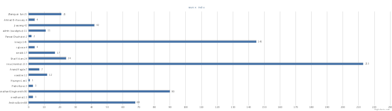

Metrics
=======

.. sidebar:: 
   . 

  .. contents:: Table of Contents
     :depth: 3

..

There are currently eight different metrics to deliver system utilization, user activities and statistics. These statistical data are collected from log files which contain trackable information and from administrative command tools like euca2ools. The metrics system has simple operations to measure specific items such as virtual machine (VM) instances, registered VM images, virtual system resources, etc and there are count, average, sum, max, and min functions. In this section, you can find descriptions, instructions, and examples for the metrics.

Number of VM instances per user
----------------------------------------------------------------------

Within the framework we have a convenient way to obtain information
about the **number of VM instances** per user. To obtain this
information you can invoke the following commands within the
``fg-metric`` shell. In this example we generate a report .... bla bla ....:

.. literalinclude:: _static/examples/example2-1.txt 

This script uses the following command:

* **clear users** - clear memory for user data
* **analyze** - analyze user data for a certain period
* **createreport** - create a graph

The output of this command sores the result in a file called .... bla
bl .. as we specified in the prefious shell commands:

    **X-axis** = indicates the number of VM instances.

    **Y-axis** = indicates an ownerid and the number of VM instances used by the ownerid.

    **Figure 1.** The number of used VM instances grouped by an ownerid (January 2012 in India)

        
Total runtime of VM instance used per user
----------------------------------------------------------------------
It is the total runtime for virtual machine instances grouped by users or accounts based on log files of eucalyptus. It shows the amount of resources used by users and a system utilization by adding up the total lifetime of instances during a certain period.

A count of VM images owned per user
----------------------------------------------------------------------
It is virtual machine image count grouped by users or accounts based on euca2ools. It shows that which user or account currently owns how many virtual machine images on the system. This metric is based on the euca2ool command *euca-describe-images* that a eucalyptus user can see a list of machine images. For example in Eucalyptus 3.0, the euca-describe-images generates information like below.
         ::

          $ euca-describe-images
          IMAGE emi-0E19393A jdiaz/ubuntuprecisejdiaz2122518911.img.manifest.xml 281408815495 available public i386 machine eki-226638E6 eri-32DE3771 instance-store
          IMAGE eri-4E163AA8 ramdik/initrd.img-2.6.28-11-generic.manifest.xml 000000000001 available public i386 ramdisk instance-store
          ...

The total number of VM instances used in a system
----------------------------------------------------------------------
It is a count of virtual machine instance used during a certain period in a system. It shows a system utilization and a performance comparison among other systems by counting launched VM instances. It is similar to the metric of the number of VM instances used per user but it is grouped by a system instead of a user.

Total runtime of VM instances used in a system
----------------------------------------------------------------------
It is a total wall-clock hour(s) for virtual machine instances used in a system. It shows the amount of resources allocated and a system utilization by adding up the total lifetime of instances during a certain period. It is similar to the metric of total runtime of VM instance used per user but it is grouped by a system instead of a user.

Total CPU cores of VM instances used in a system
----------------------------------------------------------------------
It is a total amount of CPU cores for VM instances requested by users in a system. It shows CPU resource allocation by adding up the CPU cores requested during a certain period.

Total memories of VM instances used in a system
----------------------------------------------------------------------
It is a total size of memories for VM instances requested by users in a system. It shows memory resource allocation by adding up the size of a memory block requested during a certain period.

Total disks of VM instances used in a system
----------------------------------------------------------------------
It is a total size of storage for VM instances requested by users in a system. It shows disk allocation by adding up the the size of a disk requested during a certain period.

Examples
--------
In this section, graphs, and commands for each metric will be viewed.

Total runtime of VM instance used per user
^^^^^^^^^^^^^^^^^^^^^^^^^^^^^^^^^^^^^^^^^^^^^^^^^^^^^^^^^^^^^^^^^^^^^^
   generates a graph like below.

        .. figure:: _static/examples/example2.png
           :scale: 50 %
           :alt: The wall-clock hour for all VM instances executed per user

           Figure 2. The wall-clock hour for all VM instances executed per user (January 2012 in India)

           ====== =================================================================================
           ====== =================================================================================
           X-axis indicates the total wall-clock hours for all VM instances.
           Y-axis indicates the an ownerid and the total hours of VM instances used by the ownerid.
           ====== =================================================================================

           Table 2. Specifications for the example options

        **Example commands**

        .. literalinclude:: _static/examples/example2-1.txt

        *This included block is from examples/example2-1.txt*

A count of VM images owned per user
^^^^^^^^^^^^^^^^^^^^^^^^^^^^^^^^^^^^^^^^^^^^^^^^^^^^^^^^^^^^^^^^^^^^^^
   generates a graph like below.

        .. figure:: _static/examples/example3.png
           :scale: 50 %
           :alt: A count of VM images owned per user in India

           Figure 3. A count of VM images owned per user (Current data in India)

           ====== =====================================================
           ====== =====================================================
           X-axis indicates a count of VM images owned by an ownerid.
           Y-axis indicates an account id or an user id with the count.
           ====== =====================================================

           Table 3. Specifications for the example options

        **Example commands**

        .. literalinclude:: _static/examples/example4.txt

        *This included block is from examples/example4.txt*
        
        **Related commands**

        count_images
                | Count virtual machine images per user id or account id.
                | A user should read configurations and credentials of euca2ools from the config file i.e. eucarc.
                | Otherwise, this command does not return anything.
                | Typically, this is only allowed for administrators.
        
The total number of VM instances used in a system
^^^^^^^^^^^^^^^^^^^^^^^^^^^^^^^^^^^^^^^^^^^^^^^^^^^^^^^^^^^^^^^^^^^^^^
   generates a graph like below.

        .. figure:: _static/examples/example4.png
           :scale: 50 %
           :alt: The total number of VM instances used in a system

           Figure 4. The total number of VM instances used in a system (11/01/2011 ~ 05/14/2012 in India)

           +--------------+----------------------------------------------------------------------------------------------------------------------------------------+
           +--------------+----------------------------------------------------------------------------------------------------------------------------------------+
           |X-axis:       | a day for the search range                                                                                                             |
           |              | (e.g. 0d indicates 2011/11/01 which is the first day of this search and 189d indicates 2012/05/14 which is the last day of this search)|
           +--------------+----------------------------------------------------------------------------------------------------------------------------------------+
           |Y-axis:       | instance counts                                                                                                                        |
           +--------------+----------------------------------------------------------------------------------------------------------------------------------------+
           |Search range: | 2011/11/01 00:00:00 ~ 2012/05/14 23:59:59 (189 days)                                                                                   |
           +--------------+----------------------------------------------------------------------------------------------------------------------------------------+
           |Period:       | daily                                                                                                                                  |
           +--------------+----------------------------------------------------------------------------------------------------------------------------------------+

           Table 4. Specifications for the example options

        **Example commands**

        .. literalinclude:: _static/examples/example5-1.txt

        *This included block is from examples/example5-1.txt*

        **Related commands**

        set_range
                Specify search range
        set_nodename
                Specify search node name
        analyze
                Analyze for a metric specified by -S option

                *Options*

                count
                        Analyze for counting the total number of VM instances
                runtime
                        Analyze for wall-clock hours for VM instances
                ccvm_cores
                        Analyze for CPU cores of VM instances
                ccvm_mem
                        Analyze for memory allocation for VM instances
                ccvm_disk
                        Analyze for disk allocation for VM instances
                        
        sys_report
                | Generate a graph for the analyzed data
                | 'analyze' command needs to be executed prior to run this command

Total runtime of VM instances used in a system
^^^^^^^^^^^^^^^^^^^^^^^^^^^^^^^^^^^^^^^^^^^^^^^^^^^^^^^^^^^^^^^^^^^^^^

Generates a graph as shown in Figure 5.

        .. figure:: _static/examples/example5.png
           :scale: 50 %
           :alt: The total wall-clock hours of VM instances used in a system

           Figure 5. The total wall-clock hours of VM instances used in a system (11/01/2011 ~ 05/14/2012 in India)

           +--------------+----------------------------------------------------------------------------------------------------------------------------------------+
           +--------------+----------------------------------------------------------------------------------------------------------------------------------------+
           |X-axis:       | a day for the search range                                                                                                             |
           |              | (e.g. 0d indicates 2011/11/01 which is the first day of this search and 189d indicates 2012/05/14 which is the last day of this search)|
           +--------------+----------------------------------------------------------------------------------------------------------------------------------------+
           |Y-axis:       | total wall-clock hours                                                                                                                 |
           |              | (e.g. 1860 indicates maximum used hours during this search range)                                                                      |
           +--------------+----------------------------------------------------------------------------------------------------------------------------------------+
           |Search range: | 2011/11/01 00:00:00 ~ 2012/05/14 23:59:59 (189 days)                                                                                   |
           +--------------+----------------------------------------------------------------------------------------------------------------------------------------+
           |Period:       | daily                                                                                                                                  |
           +--------------+----------------------------------------------------------------------------------------------------------------------------------------+

           Table 5. Specifications for the example options

        **Example commands**

        .. literalinclude:: _static/examples/example5.txt

        *This included block is from examples/example5.txt*

        **Related commands**

        set_range
                Specify search range
        set_nodename
                Specify search node name
        analyze
                Analyze for a metric specified by -S option
        sys_report
                | Generate a graph for the analyzed data
                | 'analyze' command needs to be executed prior to run this command

6. Total CPU cores of VM instances used in a system
   generates a graph like below.

        .. figure:: _static/examples/example6.png
           :scale: 50 %
           :alt: The total CPU cores of VM instances used in a system

           Figure 6. The total CPU cores of VM instances used in a system (11/01/2011 ~ 05/14/2012 in India)

           Table 6. Specifications for the example options
           +--------------+----------------------------------------------------------------------------------------------------------------------------------------+
           +--------------+----------------------------------------------------------------------------------------------------------------------------------------+
           |X-axis:       | a day for the search range                                                                                                             |
           |              | (e.g. 0d indicates 2011/11/01 which is the first day of this search and 189d indicates 2012/05/14 which is the last day of this search)|
           +--------------+----------------------------------------------------------------------------------------------------------------------------------------+
           |Y-axis:       | the number of CPU cores                                                                                                                |
           +--------------+----------------------------------------------------------------------------------------------------------------------------------------+
           |Search range: | 2011/11/01 00:00:00 ~ 2012/05/14 23:59:59 (189 days)                                                                                   |
           +--------------+----------------------------------------------------------------------------------------------------------------------------------------+
           |Period:       | daily                                                                                                                                  |
           +--------------+----------------------------------------------------------------------------------------------------------------------------------------+

        **Example commands**

        .. literalinclude:: _static/examples/example5-3.txt

        *This included block is from examples/example5-3.txt*

        **Related commands**

        analyze
                Analyze for a metric specified by -S option

                *Options*

                count
                        Analyze for counting the total number of VM instances
                runtime
                        Analyze for wall-clock hours for VM instances
                ccvm_cores
                        Analyze for CPU cores of VM instances
                ccvm_mem
                        Analyze for memory allocation for VM instances
                ccvm_disk
                        Analyze for disk allocation for VM instances

Total memories of VM instances used in a system
^^^^^^^^^^^^^^^^^^^^^^^^^^^^^^^^^^^^^^^^^^^^^^^^^^^^^^^^^^^^^^^^^^^^^^
   generates a graph like below.

        .. figure:: _static/examples/example7.png
           :scale: 50 %
           :alt: The total memories of VM instances used in a system

           Figure 7. The total memories of VM instances used in a system (11/01/2011 ~ 05/14/2012 in India)

           +--------------+----------------------------------------------------------------------------------------------------------------------------------------+
           +--------------+----------------------------------------------------------------------------------------------------------------------------------------+
           |X-axis:       | a day for the search range                                                                                                             |
           |              | (e.g. 0d indicates 2011/11/01 which is the first day of this search and 189d indicates 2012/05/14 which is the last day of this search)|
           +--------------+----------------------------------------------------------------------------------------------------------------------------------------+
           |Y-axis:       | the total memory allocation                                                                                                            |
           +--------------+----------------------------------------------------------------------------------------------------------------------------------------+
           |Search range: | 2011/11/01 00:00:00 ~ 2012/05/14 23:59:59 (189 days)                                                                                   |
           +--------------+----------------------------------------------------------------------------------------------------------------------------------------+
           |Period:       | daily                                                                                                                                  |
           +--------------+----------------------------------------------------------------------------------------------------------------------------------------+

           Table 7. Specifications for the example options

        **Example commands**

        .. literalinclude:: _static/examples/example5-4.txt

        *This included block is from examples/example5-4.txt*

Total disks of VM instances used in a system
^^^^^^^^^^^^^^^^^^^^^^^^^^^^^^^^^^^^^^^^^^^^^^^^^^^^^^^^^^^^^^^^^^^^^^

   generates a graph like below.

        .. figure:: _static/examples/example8.png
           :scale: 50 %
           :alt: The total disk of VM instances used in a system

           Figure 8. The total disks of VM instances used in a system (11/01/2011 ~ 05/14/2012 in India)

           +--------------+----------------------------------------------------------------------------------------------------------------------------------------+
           +--------------+----------------------------------------------------------------------------------------------------------------------------------------+
           |X-axis:       | a day for the search range                                                                                                             |
           |              | (e.g. 0d indicates 2011/11/01 which is the first day of this search and 189d indicates 2012/05/14 which is the last day of this search)|
           +--------------+----------------------------------------------------------------------------------------------------------------------------------------+
           |Y-axis:       | the total disk allocation                                                                                                              |
           +--------------+----------------------------------------------------------------------------------------------------------------------------------------+
           |Search range: | 2011/11/01 00:00:00 ~ 2012/05/14 23:59:59 (189 days)                                                                                   |
           +--------------+----------------------------------------------------------------------------------------------------------------------------------------+
           |Period:       | daily                                                                                                                                  |
           +--------------+----------------------------------------------------------------------------------------------------------------------------------------+

           Table 8. Specifications for the example options

        **Example commands**

        .. literalinclude:: _static/examples/example5-5.txt

        *This included block is from examples/example5-5.txt*
